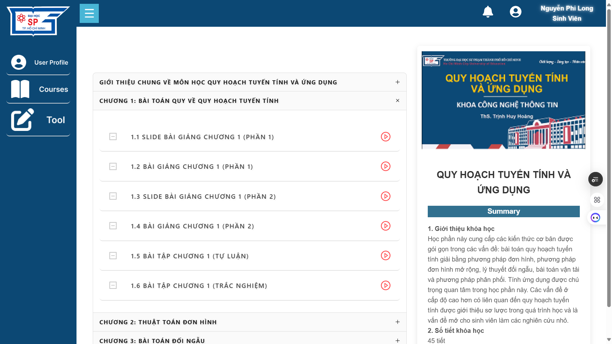

# LINEAR PROGRAMMING AND APPLICATIONS (BACK-END)
<p align="center">
  
  
</p>

## Giới thiệu
**Linear Programming and Applications (Back-End)** là hệ thống hỗ trợ học tập trực tuyến cho học phần **Quy hoạch tuyến tính và Ứng dụng** tại Trường Đại học Sư phạm TP.HCM. Hệ thống cung cấp API để quản lý khóa học, người dùng và bài tập, giúp kết nối với Front-End nhằm mang lại trải nghiệm học tập hiệu quả.

## Công nghệ sử dụng
- **Node.js & ExpressJS**: Framework mạnh mẽ để xây dựng API back-end.
- **AWS S3**: Lưu trữ và quản lý file bài tập nộp lên hệ thống.
- **Render**: Triển khai hệ thống trên môi trường production.

## Yêu cầu hệ thống
- **Node.js** phiên bản **20.17.0** (Cần cài đặt trước khi chạy dự án)

## Cấu hình AWS S3
Trước khi chạy dự án, bạn cần cấu hình AWS S3 để lưu trữ các file bài tập nộp lên hệ thống.

### 1. Tạo Bucket trên AWS S3
- Truy cập vào **AWS S3** và tạo một Bucket với tên bạn muốn.
- Tạo 5 thư mục con trong Bucket của bạn:
    - `TuLuanChuong1`
    - `TuLuanChuong2`
    - `TuLuanChuong3`
    - `TuLuanChuong4`
    - `TuLuanChuong5`
- Chọn Region: **ap-southeast-2**

### 2. Tạo IAM User và cấp quyền
- Truy cập vào **AWS IAM**, tạo một **User** có quyền truy cập vào S3.
- Cấp quyền **Read/Write** cho các Bucket mà bạn đã tạo.
- Lưu lại **Access Key ID** và **Secret Access Key**.

### 3. Cấu hình **AWS SDK**
- Cài đặt **AWS SDK** cho Node.js:
    ```bash
    npm install aws-sdk
    ```

## Cấu hình biến môi trường
Tạo file `.env` trong thư mục gốc của dự án và cấu hình các biến môi trường như sau:

- AWS_ACCESS_KEY_ID=your-access-key
- AWS_SECRET_ACCESS_KEY=your-secret-key
- AWS_BUCKET_NAME=your-bucket-name

## Cài đặt và chạy dự án
### 1. Cài đặt dependencies
Chạy lệnh sau để cài đặt các thư viện cần thiết:
```bash
npm install
```

### 2. Khởi động server phát triển
Chạy lệnh sau để khởi động dự án:
```bash
npm run dev
```

Hệ thống sẽ chạy trên **localhost**, bạn có thể kiểm tra API bằng Postman hoặc truy cập qua trình duyệt (https://nckh-qhtt-be.onrender.com/api/list-files).

## Triển khai hệ thống
Hệ thống back-end được triển khai trên **Render**. Nếu bạn muốn triển khai lại hoặc cập nhật hệ thống, thực hiện các bước sau:
1. Push code mới lên GitHub.
2. Render sẽ tự động phát hiện thay đổi và cập nhật hệ thống.

## Liên kết hệ thống
- **Back-End (GitHub)**: https://github.com/LongMyNgoc/LINEAR-PROGRAMMING-AND-APPLICATIONS-BE.git
- **Back-End (Render)**: https://nckh-qhtt-be.onrender.com/
- **Front-End (GitHub)**: https://github.com/LongMyNgoc/LINEAR-PROGRAMMING-AND-APPLICATIONS.git
- **Front-End (Vercel)**: https://nckh-qhtt.vercel.app/

## Đóng góp & Phát triển
Mọi ý kiến đóng góp hoặc báo lỗi có thể được gửi qua hệ thống quản lý mã nguồn của dự án hoặc liên hệ với nhóm phát triển. Chúng tôi hoan nghênh mọi sự đóng góp để cải thiện hệ thống!

## Thông tin liên hệ
📧 Email: nguyenphilong.dev@gmail.com 
